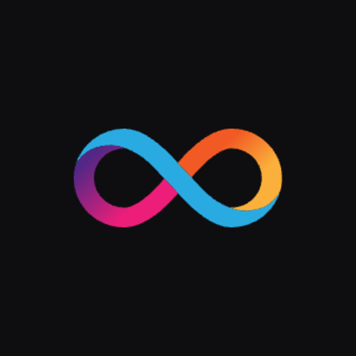

  <h1>Governance App</h1>

  

 
 

---

[Governance App](https://nns.internetcomputer.org/) offers a user-friendly platform for participating in the governance of the [Internet Computer](https://internetcomputer.org/). With this application, you can:

- Stake and manage ICPs
- Browse and vote on Governance proposals
- Delegate voting to Known Neurons
- Track your account and rewards

## Links

Some useful links:

- [DEVELOP.md](/docs/DEVELOP.md) provides guidance for local development setup.
- [FE.md](/docs/FE.md) covers frontend architecture and documentation.

## Getting Help

Here are some ways you can reach out for help or share your ideas to improve the app:

- [Issue Tracker](https://github.com/dfinity/governance-app/issues): Create a new ticket if you encounter a bug, or if an issue arises when you try to run or build the code.
- [DFINITY Forum](https://forum.dfinity.org/): The forum is a great place to look for information.
- [Support](https://support.dfinity.org/hc/en-us/requests/new): Create a support request if you'd like personalized help.
